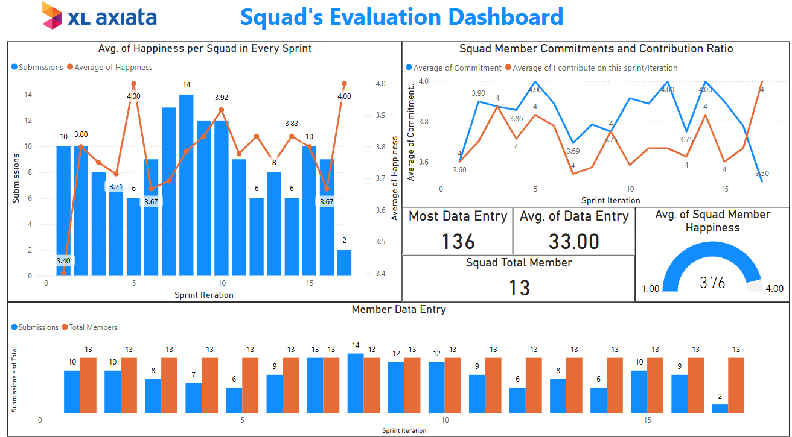

# Squad Evaluation Dashboard – PT. XL Axiata Tbk

This Power BI dashboard is designed to evaluate Agile squad performance at PT. XL Axiata Tbk, focusing on core team dynamics such as happiness, delivery, commitment, contribution, and feedback quality. The dashboard empowers Tribe Leaders, Product Owners, and Agile Coaches to make data-driven decisions about squad engagement, alignment, and delivery health across multiple sprints.

> *Note:* This project uses *dummy data*. All names have been changed and do not represent real individuals or actual team performance.

---

## Objectives

The main objectives of this dashboard are to:

- *Track squad engagement and morale* using feedback-based happiness scores
- *Evaluate agile behavior* (e.g., experimenting, feedback culture, delivery speed)
- *Identify performance bottlenecks* using delivery vs commitment data
- *Visualize tribe-level and role-based differences* across squads
- *Enable retrospective-driven improvement* through textual analysis of sprint feedback

---

## Goals

This dashboard aims to:

- Provide visibility into each squad's performance over time
- Support Agile rituals (like retrospectives) with visual and quantitative data
- Encourage transparency between tribe leaders, squad members, and stakeholders
- Create a safe space for teams to express blockers and improvements through anonymous feedback
- Highlight high-performing squads and identify those needing extra support

---

## Key Insights Unlocked

- Which squads are consistently delivering what they commit to?
- Are happiness levels improving or declining sprint by sprint?
- Do squad members feel they contribute meaningfully to goals?
- What do members say went well, what didn't, and what should be improved?
- How aligned are tribe leaders with team satisfaction scores?
- Where are feedback loops strongest or weakest?
- Are squads actively experimenting and embracing agility?

---

## Live Demo

[View Dashboard in Power BI](https://intip.in/performanceDashboard)  

---

## Preview

---

## Offline Access

You can also [*download the PDF version* of the dashboard](./Squad%20Evaluation%20Dashboard%20PT.%20XL%20Axiata%20Tbk..pdf) for offline reference.

---

## Features

- Happiness tracking by Squad, Sprint, and Role
- Contribution and commitment evaluation
- Radar chart for agile values: NWOW, Feedback, Experimenting, Quick Delivery, Ownership
- Word cloud analysis of feedback (What's Good / Bad / Needs Improvement)
- Role-level insight (Scrum Masters, Product Owners, Developers)
- Submission quality and participation rates
- Top and bottom performers

---

## Technologies Used

- Power BI Desktop & Service
- DAX for custom KPIs and calculations
- Word cloud custom visuals
- Slicers, drilldowns, bookmarks for dynamic interactivity

---

## Disclaimer

This project is for demonstration and portfolio purposes only.  
*All data is dummy, and all names have been changed.*
